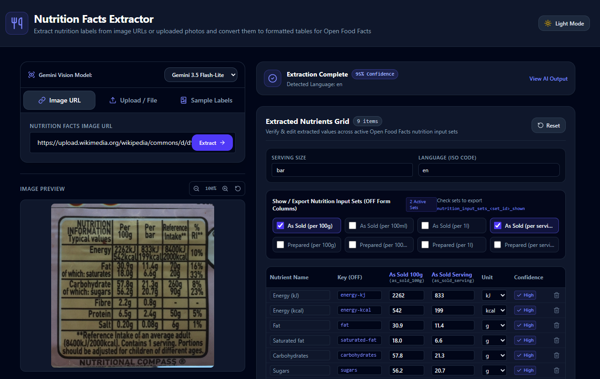

# Nutrition Facts Extractor for Open Food Facts

Extract nutrition facts data from photo URLs or uploaded images using Gemini AI and output formatted text tables for Open Food Facts.



<!--
## Features
- [Feature 1]
- [Feature 2]

## Controls
- [Control 1]
- [Control 2]
-->

## Project Setup

This project is a full-stack application built with React, Vite, and an Express backend.

### Prerequisites
- Node.js (v18+)
- npm (or bun)

### Method 1: Local Development
To run the application locally in development mode:

1. **Install dependencies:**
   ```bash
   npm install
   ```
2. **Configure Gemini API Key:**
   - Obtain an API key from [Google AI Studio](https://aistudio.google.com/app/apikey).
   - Create a `.env` file in the project root:
     ```bash
     cp .env.example .env
     ```
   - Open `.env` and set your `GEMINI_API_KEY`:
     ```env
     GEMINI_API_KEY=your_actual_api_key_here
     ```
3. **Start the development server:**
   ```bash
   npm run dev
   ```
   This starts the Express server (configured in `server.ts`) with integrated Vite middleware. You can access the app at `http://localhost:3000`.

### Method 2: Importing into Google AI Studio

1. Download the project repository as a ZIP file.
2. Extract the downloaded ZIP file.
3. Re-zip the contents so that the project files (such as `package.json`) sit directly at the root of the new ZIP file.
4. Open the [Google AI Studio Blank App Template](https://aistudio.google.com/apps/bundled/blank).
5. Click **Remix** in the top right to create a new project.
6. Remove all default files from the workspace.
7. Click **Upload zip file** and select the ZIP file created in step 3.

> **Note:** When running within Google AI Studio, API keys are managed through the AI Studio Settings menu. You do not need to manually create or configure a `.env` file.